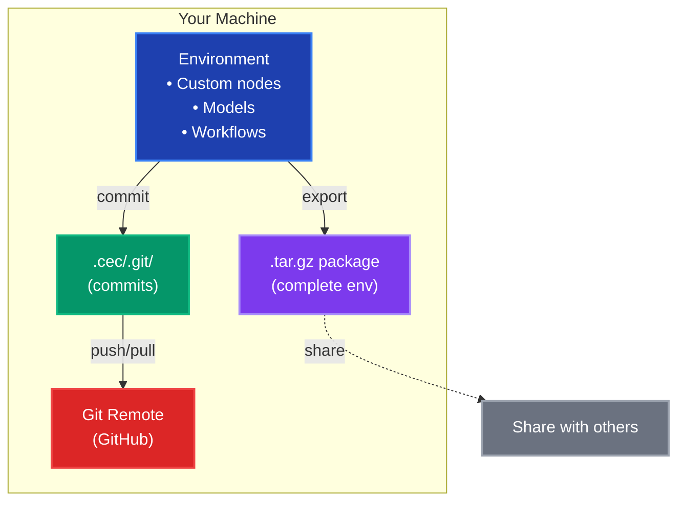

# Core Concepts

> Understand the fundamental concepts behind ComfyGit: workspaces, environments, and how reproducibility works.

## Overview

ComfyGit organizes your ComfyUI installations into a simple hierarchy:

```
Workspace (~/comfygit)
├── Environment 1 (production)
├── Environment 2 (testing)
└── Environment 3 (experiments)
```

Each level serves a specific purpose and has its own responsibilities.

## Workspace

A **workspace** is the top-level container for all your ComfyGit environments and shared resources.

### What it contains

```
~/comfygit/                      # Workspace root
├── environments/                 # All your environments
│   ├── production/
│   ├── testing/
│   └── experiments/
├── models/                       # Shared models directory
├── comfygit_cache/              # Registry cache, model index
├── logs/                         # Application logs
└── .metadata/                    # Workspace configuration
    └── workspace.json            # Settings (active env, models dir)
```

### Key features

* **One per machine** — You typically have one workspace per computer
* **Shared model index** — All environments share the same model database
* **Global configuration** — Settings like CivitAI API key are workspace-wide

### Creating a workspace

```bash
# Create in default location (~/comfygit)
cg init

# Custom location
cg init /path/to/workspace
```

The `COMFYGIT_HOME` environment variable determines the workspace location. If not set, defaults to `~/comfygit`.

## Environment

An **environment** is an isolated ComfyUI installation with its own dependencies, custom nodes, and configuration.

### What it contains

```
~/comfygit/environments/my-project/
├── .cec/                         # Configuration and version control
│   ├── pyproject.toml            # Dependencies, nodes, models
│   ├── uv.lock                   # Locked dependency versions
│   ├── workflows/                # Tracked workflows
│   └── .git/                     # Git repository
├── .venv/                        # Python virtual environment
└── ComfyUI/                      # ComfyUI installation
    ├── custom_nodes/             # Custom nodes
    ├── models/                   # Symlinks to workspace models
    └── user/default/workflows/   # Workflow files
```

### Key features

* **Isolated dependencies** — Each environment has its own Python packages
* **Version controlled** — State tracked in git for commits/rollbacks
* **Shareable** — Export as tarball or push to Git remote

### Creating an environment

```bash
# Basic creation
cg create my-env

# With Python version
cg create my-env --python 3.11

# With ComfyUI version
cg create my-env --comfyui v0.2.2

# With specific PyTorch backend
cg create my-env --torch-backend cu128

# Create and set as active
cg create my-env --use
```

## The .cec directory

The `.cec/` (ComfyUI Environment Configuration) directory is the heart of each environment. It's a git repository that tracks everything needed to reproduce your environment.

### Structure

```
.cec/
├── pyproject.toml                # Dependencies manifest
├── uv.lock                       # Locked versions
├── workflows/                    # Tracked workflows
├── .gitignore                    # Git ignore rules
└── .git/                         # Git history
```

### pyproject.toml

The main configuration file with several key sections:

**Project dependencies (ComfyUI core):**

```toml
[project]
name = "comfygit-env-my-project"
version = "0.1.0"
requires-python = ">=3.12"
dependencies = [
    "torch",
    "torchvision",
    "pillow",
    "numpy>=1.25.0",
    # ... ComfyUI's core dependencies
]
```

**ComfyGit metadata:**

```toml
[tool.comfygit]
comfyui_version = "v0.3.68"
python_version = "3.12"
```

**Node registry (installed nodes):**

```toml
[tool.comfygit.nodes.comfyui-impact-pack]
name = "ComfyUI-Impact-Pack"
registry_id = "comfyui-impact-pack"
repository = "https://github.com/ltdrdata/ComfyUI-Impact-Pack"
version = "5.5.0"
download_url = "https://cdn.comfy.org/ltdrdata/comfyui-impact-pack/5.5.0/node.zip"
source = "registry"
```

**Node dependencies (per-node packages):**

```toml
[dependency-groups]
comfyui-impact-pack-a1b2c3d4 = [
    "ultralytics>=8.0.0",
    "onnxruntime>=1.15.0",
]
```

**Model hash registry:**

```toml
[tool.comfygit.models]
0b222b1d568748dc = {
    filename = "clip_vision_h.safetensors",
    size = 1264219396,
    relative_path = "clip_vision/clip_vision_h.safetensors",
    category = "clip_vision"
}
```

**Workflow tracking:**

```toml
[tool.comfygit.workflows.my-workflow]
nodes = ["comfyui-impact-pack", "comfyui-ipadapter"]
path = "workflows/my-workflow.json"

[[tool.comfygit.workflows.my-workflow.models]]
filename = "clip_vision_h.safetensors"
category = "clip_vision"
criticality = "required"
status = "resolved"
hash = "0b222b1d568748dc"
nodes = [{node_id = "5", node_type = "CLIPVisionLoader"}]
```

**PyTorch backend configuration:**

```toml
[tool.uv]
constraint-dependencies = ["torch==2.9.1+cu129"]

[[tool.uv.index]]
name = "pytorch-cu129"
url = "https://download.pytorch.org/whl/cu129"
explicit = true

[tool.uv.sources.torch]
index = "pytorch-cu129"
```

### How it works together

Each section serves a specific purpose:

* **`[project]`** — Core ComfyUI dependencies (torch, pillow, numpy, etc.)
* **`[tool.comfygit]`** — Environment metadata (ComfyUI version, Python version)
* **`[tool.comfygit.nodes.*]`** — Registry of installed nodes with versions and sources
* **`[dependency-groups]`** — Per-node Python dependencies (PEP 735)
* **`[tool.comfygit.workflows.*]`** — Workflow dependencies and model requirements
* **`[tool.comfygit.models]`** — Content-addressable model index (hash → metadata)
* **`[tool.uv]`** — PyTorch backend constraints and custom indexes

### Why .cec?

* **Standard format** — Uses pyproject.toml, the Python standard
* **Human readable** — Edit manually if needed
* **Git-friendly** — Track changes over time
* **Lockfile included** — uv.lock ensures exact reproducibility
* **Content-addressable** — Models tracked by hash, not path

## Reproducibility model

ComfyGit uses a **two-tier approach** to reproducibility:

### Tier 1: Local versioning (Git commits)

**What it tracks:**

- Custom nodes (URLs, commits, versions)
- Python dependencies (via pyproject.toml + uv.lock)
- Model references (hashes, paths)
- Workflow files

**Commands:**

```bash
# Save current state
cg commit -m "Added IPAdapter nodes"

# View history
cg log

# Restore previous version
cg rollback v1
```

**When to use:**

- During development and experimentation
- Creating savepoints before risky changes
- Team collaboration via Git remotes

### Tier 2: Export/import packages

**What it includes:**

- Node metadata (registry IDs, git URLs + commits)
- Model download sources (CivitAI URLs, HuggingFace)
- Python dependency lockfile (uv.lock)
- Development node source code
- Tracked workflow files

**Commands:**

```bash
# Export environment
cg export my-workflow.tar.gz

# Import on another machine
cg import my-workflow.tar.gz --name imported-env
```

**When to use:**

- Sharing complete environments with others
- Moving between machines
- Long-term archival
- Distributing workflows to users

### How they work together



## Model management

ComfyGit uses a **content-addressable model index** to solve path-dependency issues.

### The problem

ComfyUI workflows reference models by path:

```json
{
  "ckpt_name": "checkpoints/sd15.safetensors"
}
```

But different users have different folder structures:

- `~/models/checkpoints/sd15.safetensors`
- `D:\AI\Models\sd15.safetensors`
- `/mnt/storage/comfyui/checkpoints/sd15.safetensors`

### ComfyGit's solution

Models are indexed by **hash** (custom type), not path:

1. Scan your models directory
2. Compute quick hash for each model
3. Store in workspace-wide database
4. Track models in pyproject.toml by hash
5. Link workflows to models via hash references
6. ComfyGit resolves hash → actual file path

**In pyproject.toml:**

```toml
# Global model registry (hash → metadata)
[tool.comfygit.models]
0b222b1d568748dc = {
    filename = "clip_vision_h.safetensors",
    size = 1264219396,
    relative_path = "clip_vision/clip_vision_h.safetensors",
    category = "clip_vision"
}

# Workflow-specific model requirements
[[tool.comfygit.workflows.my-workflow.models]]
filename = "clip_vision_h.safetensors"
category = "clip_vision"
criticality = "required"  # or "flexible" or "optional"
status = "resolved"       # or "unresolved" or "download_intent"
hash = "0b222b1d568748dc"  # Links to registry above
nodes = [{node_id = "5", node_type = "CLIPVisionLoader"}]
```

The **criticality** field indicates:

- **required** — Workflow won't work without it
- **flexible** — Can substitute with similar models
- **optional** — Nice to have but not critical

The **status** field tracks:

- **resolved** — Model found in workspace
- **unresolved** — Model not found, needs download
- **download_intent** — Queued for download

### How it works

**Indexing models:**

```bash
# Point to your existing models
cg model index dir /path/to/models

# Manually scan and index
cg model index sync
```

!!! tip "Auto index syncing"
    The model index automatically syncs before environment 
    commands to ensure fresh model data. This happens transparently
    in the background and is optimized using modification time 
    checks, so it's fast when models haven't changed. Manual 
    syncing with 'cg model index sync' is only needed if you want 
    to force a full rescan.

**Workflow resolution:**

```bash
# Resolve workflow dependencies
cg workflow resolve my-workflow.json
```

ComfyGit will:

1. Extract model references from workflow JSON
2. Compute hashes and look up in global index
3. Store model requirements in `[tool.comfygit.workflows.*]`
4. Track which nodes use each model
5. Symlink from `workspace/models/` (or custom defined models directory) to `environment/ComfyUI/models/`
6. Download missing models from known sources

**Workflow tracking benefits:**

When you commit a workflow, ComfyGit records:

- Which custom nodes are required
- Which models are used (by hash, not path)
- Model criticality levels for portability
- Exact node usage (node ID, type, widget position)
- Resolution status

This makes workflows **truly portable** — anyone importing your environment gets complete dependency information.

### Benefits

* **Path-independent** — Works regardless of folder structure
* **Deduplication** — Same model used by multiple environments
* **Source tracking** — Remember where models came from (CivitAI, HuggingFace)
* **Fast lookups** — SQLite database for quick queries
* **Criticality levels** — Know which models are essential vs optional
* **Node tracking** — See exactly where each model is used in workflows

### Model importance

Mark models in workflows as required/flexible/optional:

```bash
# Run interactively
cg workflow model importance

# Required - workflow won't work without it
cg workflow model importance my-workflow checkpoint.safetensors required

# Flexible - can substitute with similar models
cg workflow model importance my-workflow style-lora.safetensors flexible

# Optional - nice to have but not critical
cg workflow model importance my-workflow detail-lora.safetensors optional
```

This helps when sharing workflows or importing on different machines. See [Workflow Model Importance](../user-guide/workflows/workflow-model-importance.md) for details.

## Node resolution

ComfyGit resolves custom nodes through multiple sources:

### 1. ComfyUI Registry

The official registry of custom nodes:

```bash
# Add by registry ID
cg node add comfyui-depthflow-nodes
```

ComfyGit queries the registry for:

- Git repository URL
- Latest version/commit
- Python dependencies

### 2. GitHub URLs

Direct from GitHub:

```bash
# Latest commit
cg node add https://github.com/akatz-ai/ComfyUI-AKatz-Nodes

# Specific version
cg node add https://github.com/akatz-ai/ComfyUI-AKatz-Nodes@v1.0.0

# Specific commit
cg node add https://github.com/akatz-ai/ComfyUI-AKatz-Nodes@abc123
```

### 3. Development nodes

Local nodes you're developing:

```bash
# Track local node
cg node add /path/to/my-node --dev
```

This creates a symbolic link and tracks the path in pyproject.toml.

### 4. Workflow-based resolution

When resolving workflows, ComfyGit:

1. Extracts node class names from workflow JSON
2. Looks up in cached registry mappings
3. Prompts for installation if not found
4. Uses embeddings + scoring for fuzzy matching

## Dependency isolation

Each custom node gets its own dependency group in pyproject.toml:

```toml
[dependency-groups]
comfyui-depthflow-nodes-a1b2c3d4 = [
    "opencv-python>=4.0.0",
    "numpy>=1.24.0"
]

comfyui-impact-pack-e5f6g7h8 = [
    "ultralytics>=8.0.0",
    "onnxruntime>=1.15.0"
]
```

ComfyGit uses **PEP 735 dependency groups** (not optional-dependencies) for better isolation. Each group has a unique hash suffix to prevent naming conflicts.

### Benefits

* **Conflict detection** — UV reports if nodes have incompatible deps
* **Selective installation** — Install only what you need
* **Clean removal** — Remove node and its unique dependencies
* **Hash-based naming** — Prevents collisions between similarly-named nodes

### Handling conflicts

If two nodes require incompatible versions:

```bash
# ComfyGit detects conflict
✗ Dependency conflict detected:
  - comfyui-depthflow-nodes requires torch>=2.0,<2.1
  - comfyui-video requires torch>=2.1

Options:
  1. Skip comfyui-video
  2. Use constraint to force version
  3. Contact node maintainer
```

Use constraints to override:

```bash
cg constraint add "torch==2.4.1"
```

## Python dependencies

ComfyGit uses UV for Python package management:

### Adding dependencies

```bash
# Add package
cg py add requests

# Add with version constraint
cg py add "numpy>=1.24,<2.0"

# Add from requirements.txt
cg py add -r requirements.txt
```

### Listing dependencies

```bash
# Show project dependencies
cg py list

# Show all (including transitive)
cg py list --all
```

### Removing dependencies

```bash
cg py remove numpy
```

## Active environment

ComfyGit tracks which environment is currently active:

```bash
# Set active
cg use my-project

# Commands use active env by default
cg run
cg status
cg node add comfyui-depthflow-nodes

# Or specify explicitly
cg -e testing run
cg -e production status
```

The active environment is stored in `workspace/.metadata/workspace.json`.

## Key takeaways

!!! success "Workspaces"
    * One per machine
    * Contains all environments
    * Shared model index

!!! success "Environments"
    * Isolated ComfyUI installations
    * Tracked in .cec git repository
    * Shareable via export/import

!!! success "Reproducibility"
    * **Tier 1**: Git commits for local versioning
    * **Tier 2**: Export packages for sharing

!!! success "Models"
    * Content-addressable (hash-based)
    * Workspace-wide index
    * Path-independent resolution

!!! success "Nodes"
    * Multiple sources (registry, GitHub, local)
    * Dependency groups in pyproject.toml
    * Conflict detection via UV

## Next steps

Now that you understand the concepts:

<div class="grid cards" markdown>

-   :material-cube-outline: **[Managing Custom Nodes](../user-guide/custom-nodes/adding-nodes.md)**

    ---

    Learn how to add, update, and remove nodes

-   :material-file-image: **[Model Management](../user-guide/models/model-index.md)**

    ---

    Deep dive into the model index system

-   :material-git: **[Version Control](../user-guide/environments/version-control.md)**

    ---

    Master commits, rollbacks, and Git remotes

-   :material-export: **[Export & Import](../user-guide/collaboration/export-import.md)**

    ---

    Share environments with your team

</div>
